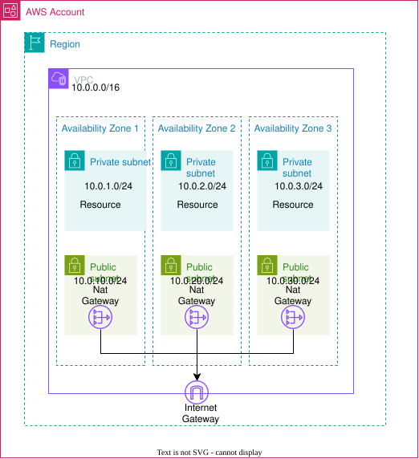
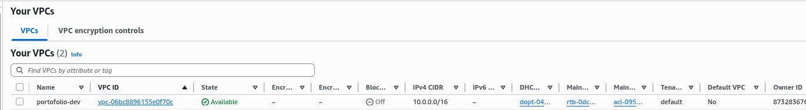
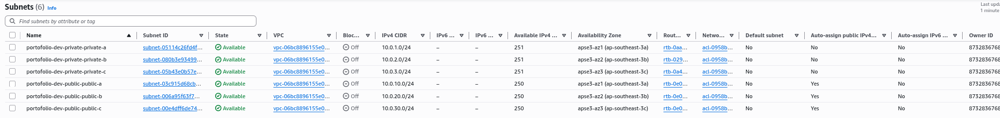
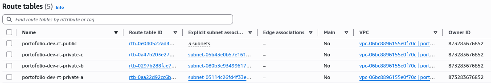
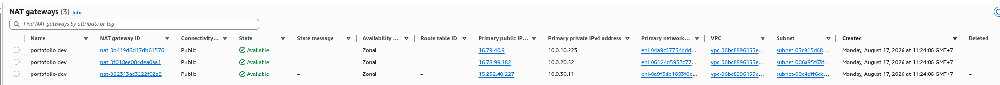
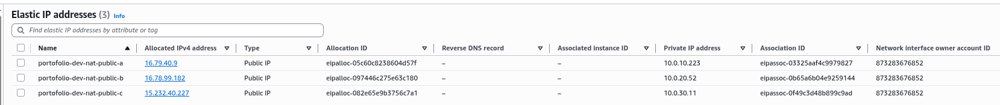

# AWS Journey – Chapter 02: Networking (VPC)




## Project Explanation

This topic provisions a **VPC** for the `portofolio` project using Terraform, following a multi-AZ, tiered network layout designed for a 3-tier architecture later on.

**What it builds:**

- **VPC** (`10.0.0.0/16`) with DNS support and hostname resolution enabled.
- **Internet Gateway (IGW)** attached to the VPC so resources can reach the internet.
- **Public subnets** across 3 Availability Zones (`10.0.10.0/24`, `10.0.20.0/24`, `10.0.30.0/24`) with auto-assign public IP enabled — for load balancers / bastion / NAT.
- **Private subnets** across 3 AZs (`10.0.1.0/24`, `10.0.2.0/24`, `10.0.3.0/24`) — for application and database tiers.
- **Elastic IPs + NAT Gateways** (optional, enabled by default) so private subnets can reach the internet for updates without inbound exposure. `single_nat_gateway` allows cost optimization by using only one NAT.

**Design highlights:**

- Uses `for_each` over a map of subnets (`public_subnet` / `private_subnet`), so AZs and CIDRs are configured as data in `variables.tf` rather than hardcoded resources.
- `locals.tf` centralizes naming (`project-environment`), tags, and the NAT gateway selection logic.
- `providers.tf` applies `default_tags` so every resource is automatically tagged.
- `security_group_rules` variable is prepared for web/SSH ingress rules (HTTP 80, HTTPS 443, SSH 22).

## Screenshots (AWS Console)

### VPC



### Subnets



### Route Tables



### NAT Gateway



### Elastic IP



## Files

```text
02-networking-vpc/
├── providers.tf              # Terraform + AWS provider config, default_tags
├── main.tf                   # VPC, IGW, subnets, NAT EIPs
├── locals.tf                 # Naming, tags, NAT gateway map
├── variables.tf              # CIDR, AZ, subnet maps, NAT & SG variables
├── terraform.tfvars.example  # Value template (copy locally)
├── assets/
│   └── 02-network-vpc-diagram.svg
└── README.md                 # you are here
```

## Usage

```bash
cd topics/02-networking-vpc
terraform init
terraform plan
terraform apply
```

**Note:** Always run `terraform destroy` after learning — NAT Gateways and unattached EIPs incur cost even when idle.
