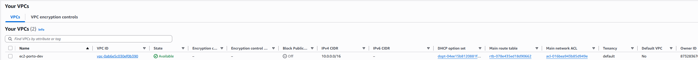
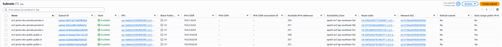
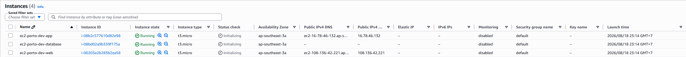
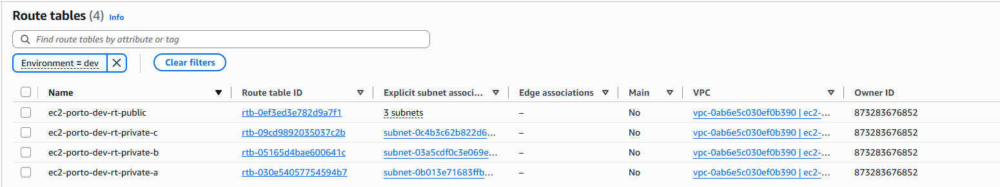

# 03-compute-ec2

## AWS EC2 Infrastructure with Terraform





---

## 📋 Table of Contents

- [Overview](#overview)
- [Prerequisites](#prerequisites)
- [Usage](#usage)
- [Architecture](#architecture)
- [Outputs](#outputs)
- [Variables](#variables)
- [License](#license)

---

## 🔍 Overview

This Terraform module creates a complete AWS VPC network infrastructure with:

- **VPC** with DNS support and hostnames enabled
- **Internet Gateway** for public subnet internet access
- **Public and Private Subnets** across 3 Availability Zones
- **NAT Gateway** for private subnet outbound internet access
- **Route Tables** (public with internet gateway, private with NAT)
- **Security Group** allowing HTTP, HTTPS, and SSH traffic
- **EC2 Instance** deployed in private subnet

---

## ⚙️ Prerequisites

- [Terraform](https://developer.hashicorp.com/terraform/downloads) >= 1.5.0
- AWS CLI configured with credentials
- AWS permissions for EC2, VPC, IAM resources

---

## 🚀 Usage

### 1. Initialize Terraform

```bash
cd topics/03-compute-ec2
terraform init
```

### 2. Review and modify variables

Edit `variables.tf` or use `terraform.tfvars` to customize:

- `key_name` - SSH key pair name
- `vpc_cidr` - VPC CIDR block
- `public_subnet` - Public subnet CIDR and AZ mappings
- `private_subnet` - Private subnet CIDR and AZ mappings
- `enable_nat_gateway` - Enable NAT gateway (default: false)
- `single_nat_gateway` - Use single NAT gateway (default: false)
- `security_group` - Security group rules
- `ec2_instance` - EC2 instance configuration

### 3. Plan the deployment

```bash
terraform plan
```

### 4. Apply the configuration

```bash
terraform apply
```

Confirm with `yes` when prompted.

---

## 📁 Project Structure

```
03-compute-ec2/
├── main.tf          # Main resource definitions
├── variables.tf     # Input variables
├── locals.tf        # Local values and tags
├── providers.tf     # Provider configuration
├── outputs.tf       # Output values
├── README.md        # This documentation
├── terraform.tfvars.example  # Example variables
└── .terraform.lock.hcl
```

---

## 🏗️ Architecture

The infrastructure includes:

| Component | Description |
|-----------|-------------|
| **VPC** | Main VPC with CIDR 10.0.0.0/16 |
| **Internet Gateway** | Enables internet access for public subnets |
| **Public Subnets** | 3 subnets (a, b, c) with map_public_ip_on_launch = true |
| **Private Subnets** | 3 subnets (a, b, c) for isolated resources |
| **NAT Gateway** | Enables private subnet outbound internet access |
| **Route Tables** | Public RT routes to IG, Private RT routes to NAT |
| **Security Group** | Allows HTTP(80), HTTPS(443), SSH(22) inbound; all outbound |
| **EC2 Instance** | Ubuntu server in private subnet |





---

## 📤 Outputs

After deployment, the following outputs are available:

- `ssh_key_name` - Name of the AWS key pair
- `ssh_private_key_path` - Path to the local PEM key file
- `ssh_command` - SSH commands for each instance
- `vpc_id` - VPC ID
- `public_subnet_ids` - Map of public subnet names to IDs
- `private_subnet_ids` - Map of private subnet names to IDs
- `nat_gateway_ids` - List of NAT gateway IDs
- `security_group_web_id` - Security group ID
- `route_table_public_id` - Public route table ID
- `ec2_summary` - Summary of all EC2 instances

---

## 🛠️ Variables

Key variables configured by default:

| Variable | Default | Description |
|----------|---------|-------------|
| `aws_region` | `ap-southeast-3` | AWS region |
| `project_name` | `portofolio` | Project name prefix |
| `environment` | `prod` | Environment (dev/stag/prod) |
| `vpc_cidr` | `10.0.0.0/16` | VPC CIDR block |
| `public_subnet` | 3 subnets | Public subnet CIDR and AZ mappings |
| `private_subnet` | 3 subnets | Private subnet CIDR and AZ mappings |
| `enable_nat_gateway` | `false` | Enable NAT gateway |
| `single_nat_gateway` | `false` | Use single NAT gateway |
| `security_group` | 3 rules | HTTP, HTTPS, SSH rules |
| `ec2_instance` | 1 instance | EC2 instance configuration |
| `key_name` | `Name-Key` | SSH key pair name |

---

## 📝 Example terraform.tfvars

```hcl
key_name = "my-key"
environment = "dev"
vpc_cidr = "10.1.0.0/16"

public_subnet = {
  "public-a" = { cidr_block = "10.1.10.0/24", az = "ap-southeast-3a" }
  "public-b" = { cidr_block = "10.1.20.0/24", az = "ap-southeast-3b" }
  "public-c" = { cidr_block = "10.1.30.0/24", az = "ap-southeast-3c" }
}

private_subnet = {
  "private-a" = { cidr_block = "10.1.1.0/24", az = "ap-southeast-3a" }
  "private-b" = { cidr_block = "10.1.2.0/24", az = "ap-southeast-3b" }
  "private-c" = { cidr_block = "10.1.3.0/24", az = "ap-southeast-3c" }
}

enable_nat_gateway = true
single_nat_gateway = false

security_group = [
  {
    description = "HTTP"
    from_port = 80
    to_port = 80
    protocol = "tcp"
    cidr_blocks = ["0.0.0.0/0"]
  },
  {
    description = "HTTPS"
    from_port = 443
    to_port = 443
    protocol = "tcp"
    cidr_blocks = ["0.0.0.0/0"]
  },
  {
    description = "SSH"
    from_port = 22
    to_port = 22
    protocol = "tcp"
    cidr_blocks = ["0.0.0.0/0"]
  }
]

ec2_instance = {
  database = {
    instance_type = "t3.micro"
    subnet_key = "private-a"
    public_ip = false
    subnet_type = "private"
    role = "Database Server"
    key_name = "database-key"
  }
}
```

---

## 🛡️ Security

- SSH access restricted via key pair
- Security group allows only specified inbound protocols
- Private subnets without direct internet access (requires bastion/vpn for SSH)
- Key file permissions set to 0400

---

## 🔄 Destroy Infrastructure

```bash
terraform destroy
```

Confirm with `yes` when prompted.

---

## 📄 License

This project is licensed under the MIT License - see the [topics/README.md](https://github.com/prasetyo/aws-infrastructure-journey) for details.

---

## 👤 Author

Created as part of AWS Infrastructure Journey portfolio.